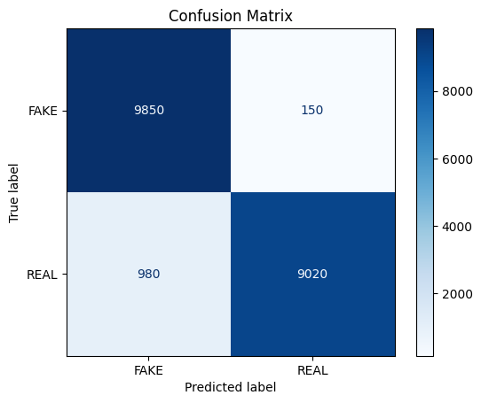
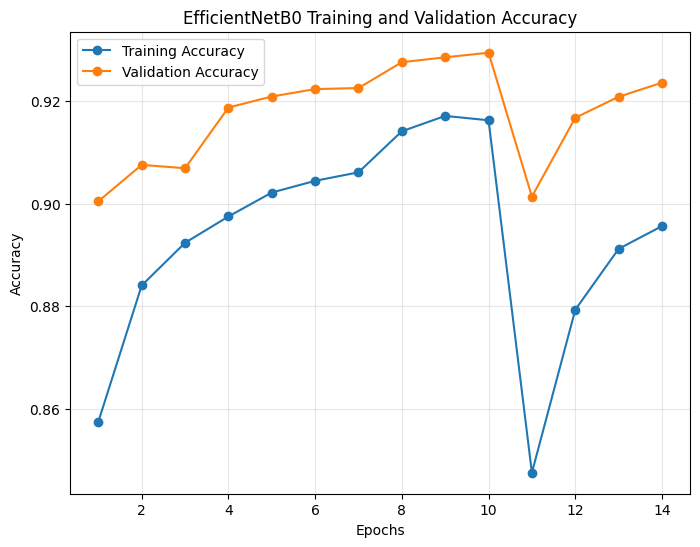
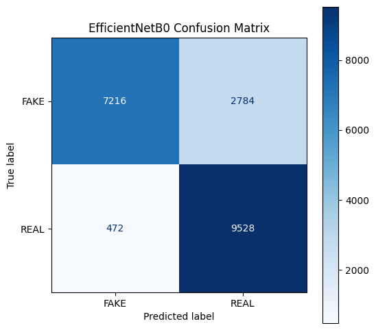
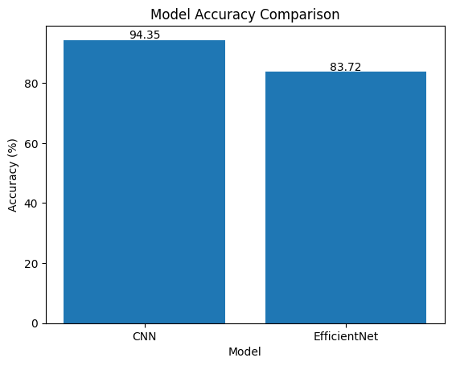

# 🧠 AI vs Real Image Classification

**Try the live application here:** [](https://aivsfake-classifier.streamlit.app/)
 
**A deep learning web application built to distinguish between real photographs and AI-generated synthetic images.**
---

## 📌 Overview
This project develops a deep learning system to classify whether an image is **real or AI-generated**. It compares two approaches:
- A Custom **Convolutional Neural Network (CNN)** built from scratch
- A transfer learning model **(EfficientNetB0)**
With the rapid rise of generative AI, detecting synthetic images has become a critical challenge, and this project explores both performance and generalization aspects of this task.

---

## 🎯 Problem Statement
The advancement of generative AI models has made it increasingly difficult to distinguish between real and AI-generated images. This project builds an automated system to classify images into two categories:
- Real Images
- AI-Generated Images

---

## 📂 Dataset
- Dataset: CIFAKE (Kaggle)
- Source: https://www.kaggle.com/datasets/birdy654/cifake-real-and-ai-generated-synthetic-images
- Structure:
  - `train/REAL`
  - `train/FAKE`
  - `test/REAL`
  - `test/FAKE`

---

## 🧠 Methodology

### 🔹 Data Preprocessing
- Rescaled images (pixel normalization: 1/255)
- Resized images to 128x128 (CNN) and 224x224 (EfficientNet)
- Applied data augmentation:
 - Rotation
 - Zoom
 - Shift (width & height)
 - Brightness adjustment
 - Horizontal flip
- Used validation split (20%) for better generalization

### 🔹 Models Used
### ✅ 1. Custom CNN (Baseline Model)
- Conv2D (32) → BatchNorm → MaxPooling
- Conv2D (64) → BatchNorm → MaxPooling
- Conv2D (128) → BatchNorm → MaxPooling
- Conv2D (256) → BatchNorm → MaxPooling
- GlobalAveragePooling
- Dense (128)
- Dropout (0.5)
- Output Layer (Sigmoid)

---

### 🚀 2. EfficientNetB0 (Transfer Learning)
- Pretrained on ImageNet
- Feature extraction + fine-tuning
- Input size: 224×224
- GlobalAveragePooling + Dense head

---

### 🔹 Training
- Loss Function: **Binary Crossentropy**
- Optimizer: Adam
- CNN Learning Rate: 1e-4
- EfficientNet Learning Rate:
- Stage 1: 1e-3
- Fine-tuning: 1e-5
- Epochs: 20
- Batch Size: 32
**Callbacks Used:**
- EarlyStopping
- ReduceLROnPlateau

---

## 📊 Results
### 🔹 CNN Performance
- Accuracy: 94.35%
- Loss: 0.15
### 🔹 EfficientNetB0 Performance
- Accuracy: 83.72%
- Loss: 0.465
---
## 📊 Model Comparison

| Metric | Custom CNN | EfficientNetB0 |
|--------|------------|----------------|
| Test Accuracy | 94.35% | 83.72% |
| Test Loss | 0.15 | 0.465 |
| FAKE Recall | ~98% | 72% |
| REAL Recall | ~90% | 95% |
| Generalization | Limited | Better |
| Real-world Images | Weak | Improved |


---

## 📈 Visualizations
### 🔹 CNN Accuracy
<p align="center">  </p>

### 🔹 CNN Confusion Matrix
<p align="center">  </p>

### 🔹 EfficientNet Accuracy
<p align="center">  </p>

### 🔹 EfficientNet Confusion Matrix
<p align="center">  </p>

### 🔹 Model Accuracy Comparison
<p align="center">  </p>

## 🛠️ Technologies Used
- Python
- TensorFlow / Keras
- NumPy, Pandas
- Matplotlib, Seaborn
- Scikit-learn

---

## ▶️ How to Run
You can explore this project in two ways: by running the interactive web application locally, or by executing the Jupyter notebooks to view the model training process.

### Option 1: Run the Web Application Locally
The easiest way to test the models is through the Streamlit interface.

**1. Clone the repository**
```bash
git clone [https://github.com/TamimHq/AIvsFAKE_image_project.git](https://github.com/TamimHq/AIvsFAKE_image_project.git)
cd AIvsFAKE_image_project
```
**2. Install dependencies**
Navigate to the ```app``` folder and install the required Python packages:
```bash
cd app
pip install -r requirements.txt
```
**3. Launch the app**
```bash
streamlit run app.py
```
The application will open automatically in your default web browser at
```bash
http://localhost:8501
```
### Option 2: Run the Training Notebooks
If you want to retrain the models or explore the data pipeline, you can run the provided Jupyter notebooks.
**1. Set up Kaggle API (for downloading the dataset)**
- Log in to your Kaggle account.

- Go to Settings -> API -> Create New Token to download your ```kaggle.json``` file.

- Place the ```kaggle.json```file in the correct directory:

  - Windows: ```C:\Users\<Windows-username>\.kaggle\kaggle.json```

  - Mac/Linux: ```~/.kaggle/kaggle.json```
    
**2. Open the Notebooks**
Navigate to the ```notebooks/``` directory and open them using Jupyter Notebook or Google Colab:
```bash
cd notebooks
jupyter notebook
```
**3. Execution Order:**
- Run ```ai_vs_real_image_classification_cnn.ipynb``` to train the custom baseline model.
- Run ```ai_vs_real_image_classification_EfficientNetB0.ipynb``` to train the transfer learning model.
- Run ```model_comparison.ipynb``` to generate evaluation metrics and visualizations.
---
## 🔍 Prediction Example
```python
   The image is predicted to be: Real
```
---
## 🧪 Model Inference (Sample Function)
```python
def predict_image(image_path):
    img = load_img(image_path, target_size=(128, 128))
    img_array = img_to_array(img) / 255.0
    img_array = np.expand_dims(img_array, axis=0)

    prediction = model.predict(img_array)
    return "Real" if prediction[0][0] > 0.5 else "AI-Generated"
```
---
## ⚠️ Limitations
- Performance depends on CIFAKE dataset
- struggle with:
   - Real-world camera images
   - Social media images
   - AI images from unseen generators

---

## 🔧 Future Improvements
- Use Transfer Learning (EfficientNet / MobileNet)
- Increase image size (e.g., 224×224)
- Train on more diverse datasets
- Improve real-world generalization
- Add deployment (web/app interface)

---

## 📁 Project Structure
```bash
AIvsFAKE_image_project/
├── models/
│   ├── cifake_model.keras(CNN model)
│   └── efficientnet_cifake.keras
├── notebooks/
│   ├── ai_vs_real_image_classification_cnn.ipynb
│   ├── ai_vs_real_image_classification_EfficientNetB0.ipynb
│   └── model_comparison.ipynb
├── app/
│   ├── app.py
│   └── requirements.txt
├── results/
│   ├── cnn_accuracy.png
│   ├── cnn_confusion_matrix.png
│   ├── efficientnet_accuracy.png
│   ├── efficientnet_confusion_matrix.png
│   └── comparison_table.png
├── README.md
├── LICENSE


```
```md
This project demonstrates a complete deep learning pipeline from data preprocessing to model evaluation and inference.
```

