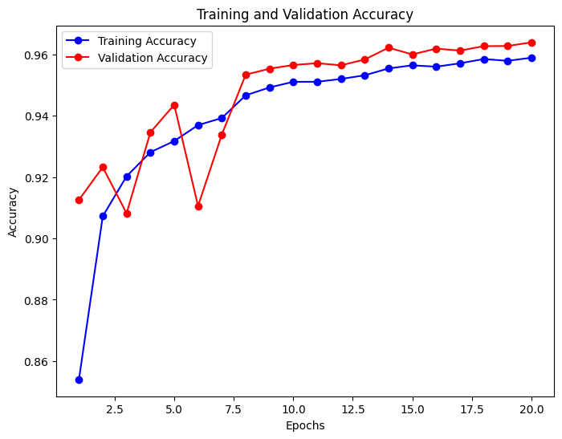
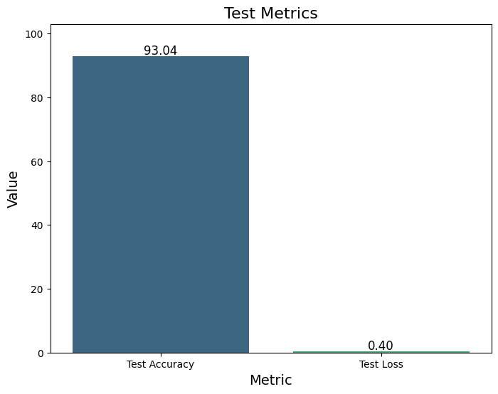

# 🧠 AI vs Real Image Classification using CNN

## 📌 Overview
This project develops a deep learning model to classify whether an image is **real or AI-generated** using Convolutional Neural Networks (CNN). With the rapid rise of generative AI, detecting synthetic images has become a critical challenge, and this project aims to address that problem.

---

## 🎯 Problem Statement
The advancement of generative AI models has made it increasingly difficult to distinguish between real and AI-generated images. This project builds an automated system to classify images into two categories:
- Real Images
- AI-Generated Images

---

## 📂 Dataset
- Dataset: CIFAKE (Kaggle)
- Source: https://www.kaggle.com/datasets/birdy654/cifake-real-and-ai-generated-synthetic-images
- Structure:
  - `train/REAL`
  - `train/FAKE`
  - `test/REAL`
  - `test/FAKE`

---

## 🧠 Methodology

### 🔹 Data Preprocessing
- Rescaled images (pixel normalization)
- Resized images to **128x128**
- Used `ImageDataGenerator` for loading data

### 🔹 Model Architecture
- Convolutional Neural Network (CNN)
  - Conv2D (32 filters)
  - MaxPooling
  - Conv2D (64 filters)
  - MaxPooling
  - Flatten layer
  - Dense (128 neurons)
  - Dropout (0.5)
  - Output layer (Sigmoid)

### 🔹 Training
- Loss Function: Binary Crossentropy
- Optimizer: Adam
- Epochs: 20
- Batch Size: 16

---

## 📊 Results
- Model evaluated on test dataset
- Achieved: **93.04% accuracy**
- Performance analyzed using:
  - Training vs Validation Accuracy Graph
  - Confusion Matrix
  - Test Accuracy & Loss

---

## 📈 Visualizations
### 🔹 Training vs Validation Accuracy

### 🔹 Confusion Matrix

### 🔹 Test Metrics

---

## 🛠️ Technologies Used
- Python
- TensorFlow / Keras
- NumPy, Pandas
- Matplotlib, Seaborn
- Scikit-learn

---
